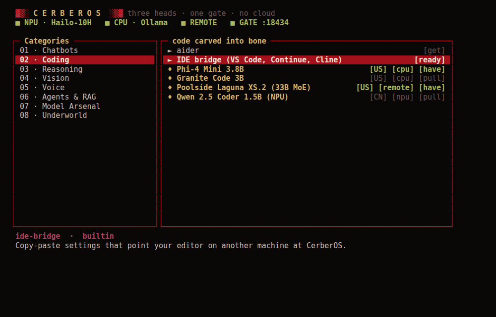
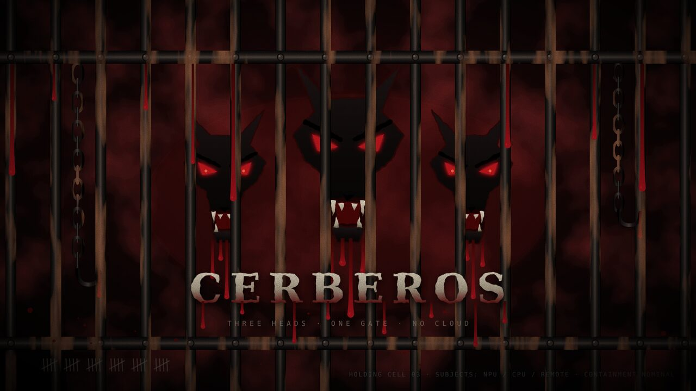

# CerberOS

**Three heads. One gate. No cloud.**

CerberOS is a Raspberry Pi OS–based distribution for running local AI on a
**Raspberry Pi 5 with the AI HAT+ 2 (Hailo-10H, 40 TOPS, 8 GB on-module RAM)**.
It takes its ease of use from Kali and Parrot: every model and tool sits in a
numbered category in a start menu, and everything installs itself the first
time you pick it. The look is grim and oppressive: dried blood, rusted iron and
bone, three hounds caged behind bars. A little of the machine shows through in
the terminal UI and stencilled text.



> **Status: early.** Everything here is linted. The gate, CLI, menu and
> generators have been tested against mock NPU, CPU and remote servers. The
> image hasn't been built or booted on real hardware yet. Expect rough edges,
> and please report them.

## The three heads and the gate

```
                 ┌───────────────────── the gate :11434 ─────────────────────┐
  Open WebUI ───▶│  Ollama API (/api/*)          OpenAI API (/v1/*)          │
  AnythingLLM ──▶│  routes by model name, translates between dialects        │
  aider, llm ───▶│  chatbots/gemma · coding/poolside · gemma3:1b · x@npu     │
  your laptop ──▶└──────┬──────────────────────┬──────────────────────┬───────┘
                        ▼                      ▼                      ▼
              NPU head :8000           CPU head :11436         REMOTE head (optional)
              hailo-ollama on          Ollama on the Pi's      any Ollama / OpenAI-
              the Hailo-10H            CPU, any GGUF model     compatible box on your LAN
```

- **NPU head.** Hailo's `hailo-ollama` runs Hailo-compiled models on the
  accelerator, which leaves the CPU free. Only Hailo can compile them, so the
  choice is short: Meta's Llama 3.2 1B, plus Qwen and DeepSeek.
- **CPU head.** Stock Ollama runs anything from the Ollama library that fits in
  the Pi's RAM: Gemma, Llama, Phi, Granite, Hermes, Moondream, embedding
  models, and so on.
- **Remote head.** Point it at a bigger machine to use models a Pi can't hold,
  such as Poolside's 33B Laguna XS.2 or OpenAI's gpt-oss 20B.
- **The gate** sits on Ollama's standard port, 11434, so **any app that
  supports Ollama finds every head with no setup**. It also serves the
  OpenAI API at `/v1`, for tools that only speak OpenAI. It merges the model
  lists from all three heads and routes each request by model name. It
  translates where a head doesn't speak the client's dialect: OpenAI requests
  to the NPU become Ollama requests, and Ollama requests to an OpenAI-only
  remote become OpenAI requests.

Model names the gate accepts:

| Name | Goes to |
| --- | --- |
| `chatbots/gemma` | Catalog alias: the head and model listed in the catalog |
| `gemma3:1b` | Raw name: whichever head has it, checking NPU, then CPU, then remote |
| `qwen2:1.5b@cpu` | Raw name on a head you choose: `@npu`, `@cpu` or `@remote` |

## Models, sorted by strength

Models live in `/srv/local-models/<strength>/<model>/` (also `~/local-models`).
Each folder holds a model card and a `./chat` launcher, and every tool can call
the model by its path:

```
local-models/
├── chatbots/   llama-npu ★  gemma ◆  llama  hermes  granite  gemma-tiny ◆  qwen-npu ★
├── coding/     phi  granite-code  poolside (remote)  qwen-coder-npu ★
├── reasoning/  phi-reasoning  gpt-oss (remote)  deepseek-r1-npu
├── vision/     gemma-vision  granite-vision  moondream
└── agents/     granite-agent  nemotron  nomic-embed ◆  embeddinggemma
                ◆ baked into the image   ★ downloaded at first boot   others: on first use
```

**American-made first.** 18 of the 21 models come from US companies (Meta,
Google, Microsoft, IBM, OpenAI, NVIDIA, Nous Research, Poolside, Nomic,
Moondream). They're listed first in every category and used as defaults.
`cerb models --us` shows only those. The three Chinese models (Qwen and
DeepSeek) are kept only on the NPU, because there they're most of what Hailo
has compiled.

| Model | Maker | Head | Good at |
| --- | --- | --- | --- |
| `chatbots/llama-npu` | Meta | NPU | Default. Fast chat with the CPU left free (needs Hailo GenAI 5.2+, see below) |
| `chatbots/gemma` | Google | CPU | Gemma 3 1B, the quickest CPU chat model (~20 tok/s). The fallback default |
| `chatbots/llama` | Meta | CPU | Llama 3.2 3B, better prose |
| `chatbots/hermes` | Nous Research | CPU | Hermes 3 3B: steerable, holds a persona, fewer refusals |
| `chatbots/granite` | IBM | CPU | Granite 4.0 Micro: summaries, business writing, tool use |
| `chatbots/gemma-tiny` | Google | CPU | Gemma 3 270M, for shell pipelines and classification |
| `chatbots/qwen-npu` | Alibaba | NPU | NPU fallback for Hailo GenAI 5.1.1 |
| `coding/phi` | Microsoft | CPU | Phi-4 Mini: code, maths, function calling. aider's default |
| `coding/granite-code` | IBM | CPU | Code trained only on permissively licensed sources |
| `coding/poolside` | Poolside | Remote | Laguna XS.2: 33B MoE agentic coder, needs about 24 GB RAM |
| `coding/qwen-coder-npu` | Alibaba | NPU | The only NPU coder. Fast enough for IDE autocomplete |
| `reasoning/phi-reasoning` | Microsoft | CPU | Phi-4 Mini Reasoning: step-by-step maths and logic |
| `reasoning/gpt-oss` | OpenAI | Remote | gpt-oss 20B, adjustable reasoning effort |
| `reasoning/deepseek-r1-npu` | DeepSeek | NPU | The only NPU reasoner |
| `vision/gemma-vision` | Google | CPU | Gemma 3 4B: reads images (8 GB Pi) |
| `vision/granite-vision` | IBM | CPU | Documents, charts, tables |
| `vision/moondream` | Moondream | CPU | Small image captioner |
| `agents/granite-agent` | IBM | CPU | Granite 4.0 Tiny: 7B MoE with 1B active, built for tool calling |
| `agents/nemotron` | NVIDIA | CPU | Nemotron Mini 4B: function calling and RAG |
| `agents/nomic-embed` | Nomic AI | CPU | Embeddings for RAG in Open WebUI and AnythingLLM |
| `agents/embeddinggemma` | Google | CPU | Multilingual embeddings |

**Llama on the NPU needs a newer Hailo package.** Hailo's GenAI Model Zoo
added Llama 3.2 1B in release 5.2.0. The build downloads 5.1.1 by default,
because that's the release with a public download link. Get 5.2 or newer from
the [Hailo Developer Zone](https://hailo.ai/developer-zone/) and build with
`HAILO_GENAI_DEB=/path/to/hailo_gen_ai_model_zoo_<version>_arm64.deb`.
Without it, first boot skips `chatbots/llama-npu` and the default falls back to
`chatbots/gemma` on the CPU. Once it's installed, `cerb models` and
`curl localhost:8000/hailo/v1/list` show what the NPU can pull.

`cerb pull` checks the Pi's RAM before downloading a CPU model, and won't pull a
remote-head model until a remote head is configured. Any other Ollama model
works by its raw name (`cerb pull olmo2`). To add your own entry to the
catalog, put it in `/etc/cerberos/catalog.d/*.toml` and run `sudo cerb sync`.

## Apps, by category

| # | Category | Apps |
| --- | --- | --- |
| 01 | Chatbots | **Cerberus Chat** (terminal) ◆, **Open WebUI** ◆★, **llm** CLI ◆ |
| 02 | Coding | **aider**, IDE bridge (Continue, Cline and VS Code settings) ◆ |
| 03 | Reasoning | (models only) |
| 04 | Vision | Hailo vision demos (detection, pose, segmentation, depth) |
| 05 | Voice | whisper.cpp (speech to text), Piper (text to speech) |
| 06 | Agents & RAG | AnythingLLM, n8n |
| 07 | Model Arsenal | Model manager, "Devour any model" |
| 08 | Underworld | Status, Doctor, Benchmark, Gate, Logs, Settings, btop |

◆ installed in the image. ★ its container is downloaded at first boot. Every
other app asks once and installs itself when you first launch it. Web apps run
in Docker on the host network, already connected to the gate:
Open WebUI on :3000, AnythingLLM on :3001, n8n on :5678.

## The `cerb` command

Type `cerb` to open the start menu: ←→ switch panes, 1–8 jump to a category,
Enter launches, `i` installs, `x` removes. Or use it directly:

| Command | Alias | What it does |
| --- | --- | --- |
| `cerb chat [model]` | `summon` | Streaming chat. `/model`, `/system`, `/clear`, `/save` |
| `cerb ask [-m model] "…"` | | One-shot answer. Piped input is appended: `dmesg \| cerb ask "anything wrong?"` |
| `cerb models [--us]` | `ls` | Every model by category, installed or not. `--us`: American-made only |
| `cerb pull <model>` | `devour` | Download, with a progress bar |
| `cerb rm <model>` | `banish` | Delete |
| `cerb use <model>` | | Set the default model |
| `cerb apps [category]` | | Every app by category |
| `cerb launch <app\|model>` | `unleash` | Start anything; installs it first if needed |
| `cerb status` | `heads` | Heads, gate, temperature, throttling, memory |
| `cerb gate` | | Endpoints, plus copy-paste settings for Open WebUI, Continue, Cline, aider and the OpenAI SDK |
| `cerb doctor` | `rite` | Checks the board, PCIe, driver, every head, the gate and power |
| `cerb bench`, `logs`, `restart`, `config`, `sync` | | Benchmark, logs, restart, edit settings, rebuild the menu |

## Two editions

- **lite** (default): console only. Boots to a login screen with a bleeding
  banner, and `cerb` is the start menu. Leaves the most RAM for models.
- **desktop**: XFCE in the same grim theme. The Whisker start menu gets
  Kali-style numbered categories that hold every app and model. The wallpaper
  and login screen show three hounds caged behind rusted bars. The terminal
  uses the dried-blood palette, and the workspaces are named NPU, CPU and
  REMOTE. On first login, the menu opens in a terminal.



## Build it

You need Docker (any x86_64 or arm64 Linux host works) and about 25 GB of disk.

```sh
cd projects/cerberos
./build.sh                          # lite edition
CERBEROS_FLAVOR=desktop ./build.sh  # desktop edition
```

The image lands in `deploy/`. Flash it with Raspberry Pi Imager ("Use custom")
or with `xz -dc deploy/*.img.xz | sudo dd of=/dev/sdX bs=4M status=progress`.

| Variable | Default | |
| --- | --- | --- |
| `CERBEROS_FLAVOR` | `lite` | `lite` or `desktop` |
| `CERBEROS_USER` | `hellhound` | Login user |
| `CERBEROS_PASS` | random | Printed at the end and saved to `deploy/password.txt` |
| `CERBEROS_SSH_PUBKEY` | — | Path to a `.pub` key to authorise for SSH |
| `CERBEROS_HOSTNAME` | `cerberos` | Reach it at `cerberos.local` |
| `CERBEROS_WIFI_COUNTRY` | — | e.g. `GB`. Needed before Wi-Fi works |
| `CERBEROS_TIMEZONE`, `CERBEROS_KEYMAP` | `Etc/UTC`, `us` | |
| `CERBEROS_BAKE_MODELS` | `1` | Bake the catalog's `preload = "build"` models into the image |
| `HAILO_GENAI_DEB` | Hailo's public 5.1.1 URL | hailo-ollama `.deb`: a path, a URL, or `none` |
| `OLLAMA_TARBALL` | ollama.com arm64 build | A path, a URL, or `none` |
| `PI_GEN_REF` | `arm64` | pi-gen branch or tag |
| `NO_DOCKER` | `0` | `1` builds natively (with `sudo`, on Debian or Pi OS) |

Baking works because Ollama's model files don't depend on the CPU
architecture: an x86 Ollama in Docker downloads them on the build host, and
they run on the Pi unchanged. Downloads are cached in `work/`.

## First boot

1. Use the official 27 W USB-C supply and an active cooler.
2. Boot, then log in at the console or with `ssh hellhound@cerberos.local`.
   The first boot downloads the NPU models and the Open WebUI container in the
   background. Follow it with `cerb logs`.
3. Run `cerb doctor`, then `cerb`.

To use a bigger machine as the remote head, run Ollama on it and make it
listen on the LAN (`OLLAMA_HOST=0.0.0.0`). Then on the Pi, run `cerb config` and
set `CERBEROS_REMOTE_URL=http://<pc>:11434`, then `cerb pull coding/poolside`.
To share your models with the rest of the LAN, set `CERBEROS_GATE_LAN=1`. Also
set `CERBEROS_GATE_KEY` to require a bearer token from other machines.

## What else is tuned

- PCIe Gen 3 for the HAT, with PCIe link power management off, the CPU
  governor on `performance`, and Wi-Fi power save off.
- Ollama keeps one model loaded at a time, because RAM is the Pi's limit. Both
  model servers run at a higher priority than everything else.
- To spare the SD card, swap is compressed in RAM (zram) and logs stay in RAM.
  Background apt and man-db jobs are off.
- Root is locked; pi-gen would otherwise leave it as `root`/`root`. The gate
  runs as its own unprivileged, sandboxed user.
- The dried-blood palette loads from the kernel command line, so it's there
  from the first boot message. The palette is arterial and fresh-blood reds,
  rust, tallow, bone, bruise, bile and cold iron. The console uses a Terminus
  font, with a bleeding banner on the login screen and at login, a prompt that
  shows failed exit codes, and matching tmux and fastfetch themes.
- The wallpaper and icons come from `tools/make-art.py`; edit it and re-run it
  to change them.

Security trade-offs to know about: the first user is in the `docker` group,
which is equivalent to root, so web apps can start without sudo. The web apps
listen on the LAN.

## Layout

```
build.sh                    clones pi-gen, fetches heads, bakes models, builds
stage-cerberos/
  00-hailo/                 NPU head: Hailo-10H driver (DKMS), HailoRT, hailo-ollama
  01-ollama/                CPU head: Ollama + baked models
  02-overlay/files/         copied verbatim into the image:
    etc/cerberos/             cerberos.conf, catalog.toml, catalog.d/, palette, shell theme
    usr/local/bin/cerb        the command
    usr/local/lib/cerberos/   the cerberos Python package (gate, CLI, menu, sync), app recipes
  03-apps/                  Docker, pipx apps, gate user, /srv/local-models + menu generation
  04-system/                config.txt / cmdline.txt, services, zram, lockdown
  05-theme/                 console font, login screen, dotfiles, os-release
  06-desktop/               desktop edition only: XFCE, LightDM, wallpaper, Whisker menu
tools/make-art.py           regenerates the wallpaper and icons (SVG)
```

The `cerberos` package uses only the Python standard library.

## Works with

[feather-llm-keyboard](../feather-llm-keyboard) runs on CerberOS unchanged. To
let it use any head, change its URL to the gate:
`--llm-url http://localhost:11434 --model chatbots/gemma`.
