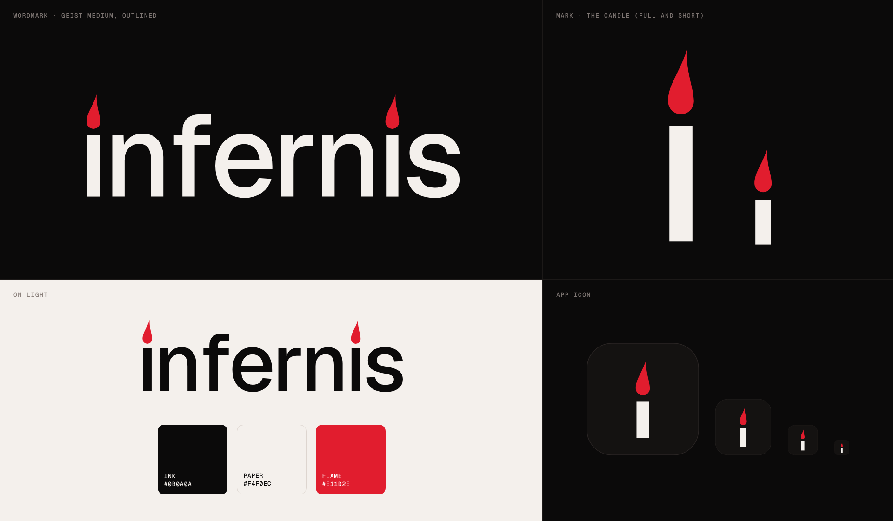

# Infernis

Brand and launch trailer for Infernis, a local AI hosting business.



## The logo

Both i's in the wordmark are candles. The stem is the letter and the dot is a
crimson flame. The mark is the same candle on its own, so the trailer can open
close on one candle and pull back into the full wordmark.

| File | Use |
| --- | --- |
| `brand/infernis-wordmark.svg` | Wordmark for dark backgrounds |
| `brand/infernis-wordmark-light-bg.svg` | Wordmark for light backgrounds |
| `brand/infernis-wordmark-mono.svg` | One colour, follows `currentColor` |
| `brand/infernis-mark.svg` | The candle, full height |
| `brand/infernis-mark-small.svg` | Short candle for favicons and small sizes |
| `brand/infernis-icon.svg` | App icon (1024 × 1024) |

| Colour | Hex |
| --- | --- |
| Ink | `#0B0A0A` |
| Paper | `#F4F0EC` |
| Flame (crimson) | `#B8122F` |

Type is [Geist](https://github.com/vercel/geist-font) (SIL Open Font License, in
`fonts/`). The wordmark is outlined, so the SVGs don't need the font installed.
To change the logo, edit the constants at the top of `brand/make_brand.py` and run
it (`pip install fonttools brotli`).

## The trailer

`trailer/infernis-trailer.mp4` is the finished trailer: 55 seconds at 1080p and 60 fps, with
sound. `trailer/infernis-trailer.html` is the same trailer as a single page that
plays in any browser, with play, seek and full-screen controls.

The trailer is a prompt box with a local model selected. It types a request, and
each project builds itself out of it:

1. **Cold open.** A glowing `localhost` pill, then the prompt box.
2. **CerberOS.** Three heads (NPU, CPU, remote) wire into one gate on `:11434`,
   then the real wallpaper and a rebuilt start menu fly in as 3D cards.
3. **Feather LLM Keyboard.** Pi, Feather and laptop draw themselves, and data
   pulses along the wires while the LED goes red, green, then blue as a haiku
   types out on the laptop.
4. **Scream and Run.** A heartbeat trace, Onryo walking in, the mod's own phase
   lines ("She's watching." "She's hunting you." "RUN.") and the 5:00 timer.
5. **The four plugins.** prompt-prefix, breadcrumbs, scope-fence and
   session-receipt, one quick cut each.
6. **Code and statement.** The CerberOS gate code in 3D with `localhost:11434`
   circled, then "Your models. Your hardware. Your rules."
7. **The candle.** A spark lights the candle, the camera pulls back into
   `infernis`, an ember lights the second i, and the tagline comes in:
   "AI that never leaves the room."

Everything is drawn from time, frame by frame, so the page and the MP4 match
exactly. The soundtrack is synthesized from the same cue times.

### Rebuild it

Needs Python 3 with numpy, ffmpeg, and Node with Playwright.

```sh
cd projects/infernis/trailer
python3 build.py        # inline fonts, images and the wordmark -> infernis-trailer.html
node cues.cjs           # read keystroke and heartbeat times out of the page
python3 soundtrack.py   # synthesize build/soundtrack.wav and .mp3
python3 build.py        # build again, now with the soundtrack inside
node render.cjs         # render infernis-trailer.mp4
```

`node render.cjs --fps 12 --scale 0.5 --out build/preview.mp4` makes a quick
preview in about a minute. `--from` and `--to` render a section. Scene timings
live in `trailer.src.html`; each `scene(id, start, duration, ...)` call is one
shot.

## No Uplink

`no-uplink/infernis-no-uplink.mp4` is a second, separate edit made for mood
rather than for pitching: 58 seconds in the style of a defense-tech launch film.
It never says what the work is for. The copy stays understated and the visuals
carry the rest: terrain, airframes, sensor tracks and a thermal lock.
`no-uplink/infernis-no-uplink.html` plays it in a browser.

1. **Signal.** Links to an uplink go dark one by one. "Most AI stops at the
   edge of the network." "We start there."
2. **Boot.** The HUD comes up, the boot log runs, and radar finds three heads.
3. **CerberOS.** Heads and gate on a contour map. "Inference at the edge. No uplink."
4. **Ember.** A swarm holds formation after its mesh link is jammed.
   "Lose the link. Keep the mission."
5. **Feather.** The bridge schematic, armed by a button press.
   "The model can't arm itself. A human always decides."
6. **Flare.** An infrared feed classifies two drones and a bird, then holds
   track 07 for an operator.
7. **Doctrine.** Hard cuts through the numbers and the plugins, ending in a wall
   of screens.
8. **Statement.** "The network will go dark." "Your advantage won't."
9. **The candle.** A white-hot signature is locked on infrared, cuts to colour,
   and pulls back into the wordmark. "No uplink required."

Ember and Flare are concepts made up for this edit; they aren't projects in
this repo. Everything else on screen comes from CerberOS and the Feather
keyboard as they are.

The pipeline is the same as the trailer's, from `projects/infernis/no-uplink`:
`python3 build.py`, `node cues.cjs`, `python3 soundtrack.py`, `python3 build.py`,
`node render.cjs`.

## The Gate

`the-gate/infernis-the-gate.mp4` is a third, separate edit: 58 seconds of
villain-coded corporate menace for a fictional AI security contractor that sits
in front of crypto and stock trading platforms. The "evil" lives in the tone and
the design (cold, quiet, everywhere); nothing on screen shows anyone doing
anything wrong. `the-gate/infernis-the-gate.html` plays it in a browser.

1. **Pre-market.** A candlestick chart draws itself under a ticker tape of
   made-up symbols. "Every trade passes through something." "Usually, it's us."
2. **The map.** At the opening bell, exchanges, brokerages, custodians, market
   makers and wallets reroute through one crimson gate until 212 venues sit
   behind it. "Every exchange has a gate." "We built most of them."
3. **CerberOS Enterprise.** CerberOS pictured as a hosted product: three heads
   under load, a live ALLOW/DENY log and four numbers. "Three heads. One gate.
   No exceptions."
4. **Perimeter.** scope-fence keeps an agent inside its tiles; reaches outside
   are refused at the fence. "Your agents touch what we allow."
5. **Audit.** session-receipt as an endless receipt tape. "We keep the receipts."
6. **The key.** Feather as a hardware key only a person can press.
   "Some decisions still need a hand on the key."
7. **Numbers** and **statement.** "You've never heard of us." "You've used us today."
8. **The candle.** The last red candle on a chart turns to wax, lights, and pulls
   back into the wordmark. "Nothing gets past the gate."

CerberOS Enterprise, the venues and every ticker symbol are made up for the
edit. The pipeline is the same as the other two, from `projects/infernis/the-gate`.
